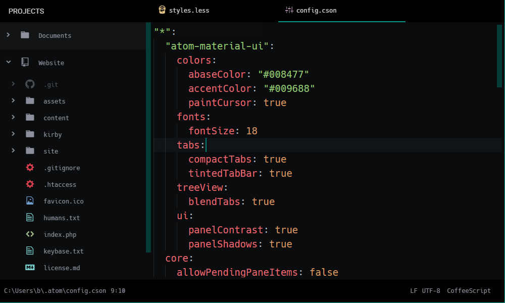

Atom Configuration
=======

Here are the contents of my [Atom](https://atom.io/) configuration directory.

Here's how to use these settings in your own Atom installation:

1. Install the [Fira Mono Regular](https://github.com/mozilla/Fira) font on your computer
2. Install [PHP CS Fixer](http://cs.sensiolabs.org/) on your computer
3. Open Atom and navigate to Settings > Packages and install the Atom packages listed in [packages.cson](packages.cson)
4. Close Atom
5. Copy all files in this folder (besides `readme.md`, `packages.cson` and `screenshot.png`) to your *.atom* folder (`~/.atom` on Linux and Mac or `%USERPROFILE%\.atom` on Windows)
6. Open Atom to use the new font, packages and configuration files
7. Update the path for the PHP CS Fixer executable in the `php-cs-fixer > executablePath` section in [config.cson](config.cson)
8. Restart Atom
