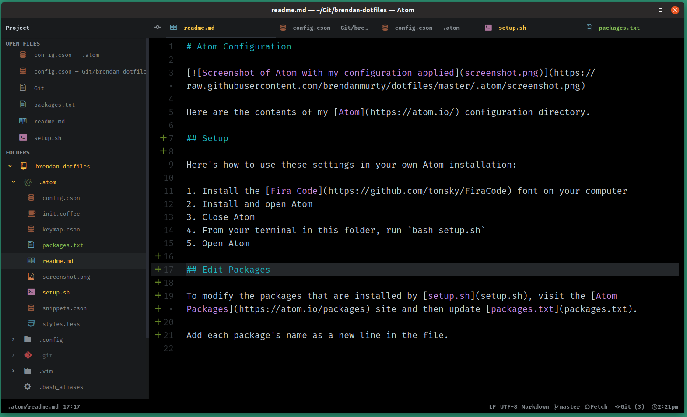

Atom Configuration
=======

Here are the contents of my [Atom](https://atom.io/) configuration directory.

Here's how to use these settings in your own Atom installation:

1. Install the [Hack font](https://github.com/chrissimpkins/Hack) on your computer
2. Open Atom and navigate to Settings > Packages to install the Atom packages listed in [packages.cson](https://github.com/brendanmurty/atom-configuration/blob/master/packages.cson)
3. Close Atom
4. Copy all files from this repository (besides `readme.md`, `packages.cson` and `screenshot.png`) to your *.atom* folder (`~/.atom` on Linux and Mac or `%USERPROFILE%\.atom` on Windows)
5. Open Atom to use the new font, packages and configuration files
