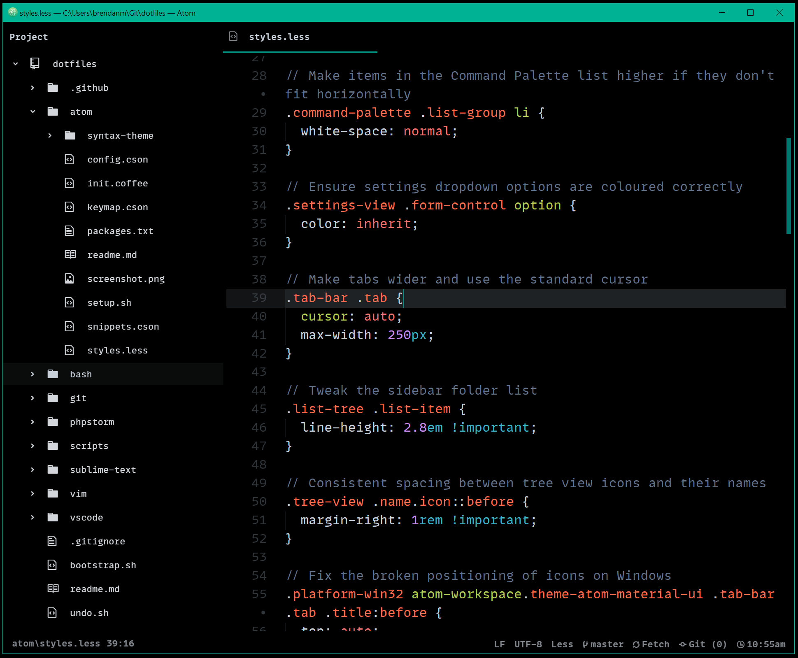

# Atom Configuration

Here are the contents of my [Atom](https://atom.io/) configuration directory.

## Setup

Here's how to use these settings in your own Atom installation:

1. Install the [Fira Code](https://github.com/tonsky/FiraCode) font on your computer
2. Install and open Atom
3. Close Atom
4. From your terminal in this folder, run `bash setup.sh`
5. Open Atom

## Edit Package List

To modify the packages that are installed by [setup.sh](setup.sh) edit [packages.txt](packages.txt) and add each package's name as a new line in the file.

Refer to the [Atom Packages](https://atom.io/packages) site for a list of available packages.
