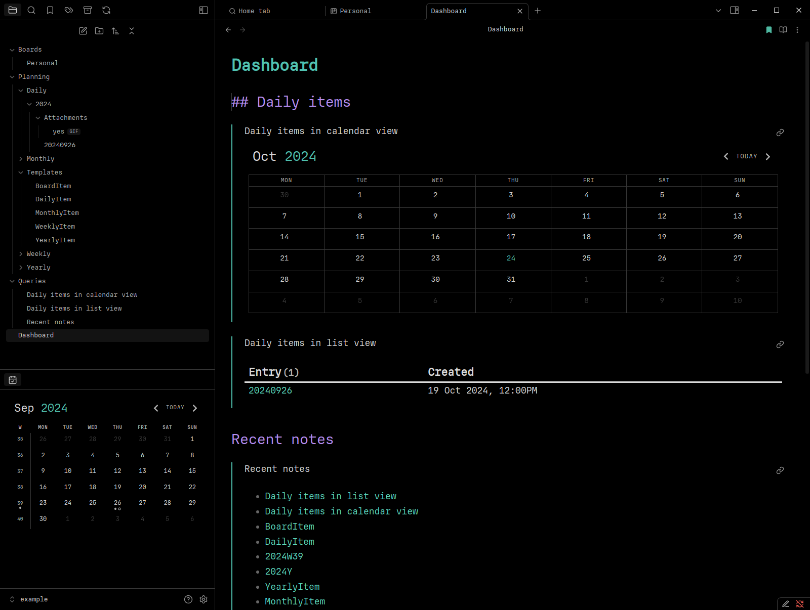
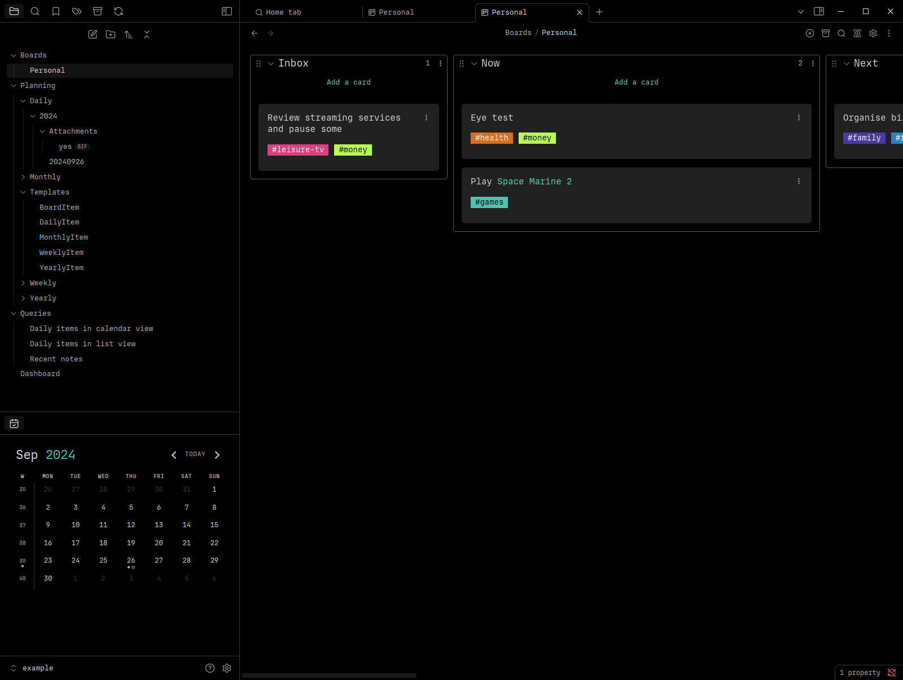
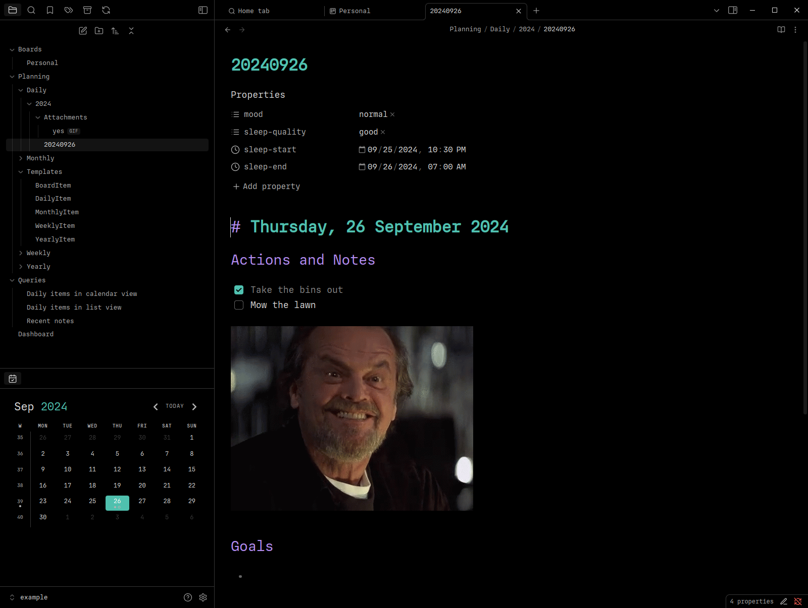

# Obsidian Configuration

My custom [Obsidian](https://obsidian.md/) configuration files ([config](config/)), example note vault ([example](example/)), and helper scripts ([obsidian-backup-config.sh](obsidian-backup-config.sh) and [obsidian-apply-config.sh](obsidian-apply-config.sh)).

## Previews

Here's some previews of Obsidian running with these settings using the vault in the [example directory](example).

## Initial Setup

1. Install and open [Obsidian](https://obsidian.md/)
2. Create a new Obsidian vault named `Notes` in your user directory
3. Close Obsidian
4. Setup fonts
  - Purchase your own license for the `Regular` variant of the [IO font by Mass-Driver](https://io.mass-driver.com/) and install the OTF file on your machine
  - Alternatively, use your own fonts and update font names in files inside of the [config directory](config/)
5. Run [obsidian-apply-config.sh](obsidian-apply-config.sh): `bash ./obsidian-apply-config.sh`
6. Open Obsidian

## Backup Current Obsidian Config

Run [obsidian-backup-config.sh](obsidian-backup-config.sh): `bash ./obsidian-backup-config.sh`
